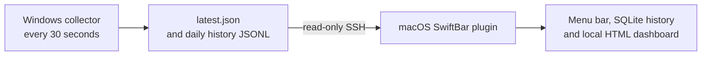

# WinBarMonitor

[](https://github.com/RS-zlk/WinBarMonitor/actions/workflows/ci.yml)

WinBarMonitor is a dependency-free [SwiftBar](https://swiftbar.app/) plugin
that puts live metrics from a Windows PC in the macOS menu bar. It shows CPU,
memory, C: drive, network, uptime, top processes, and optional NVIDIA GPU
data. In the recommended mode, Windows collects locally every 30 seconds and
macOS reads prepared records over SSH, so history continues while the Mac is
off.

[中文文档](README.zh-CN.md)

## What it looks like


This sanitized screenshot preserves the real SwiftBar layout without exposing a
real hostname, process name, PID, timestamp, GPU model, or performance record.
Its remaining values are synthetic examples.

## Features

- Generic SSH alias by default: `windows-monitor`.
- Displays the remote hostname, then the configured alias, then `Windows PC`
  when the hostname is unavailable.
- Green online, yellow cached, and red offline custom PNG icons.
- Last successful metrics are cached locally for short offline visibility.
- The Windows collector buffers a current snapshot and UTC-day history files;
  macOS automatically backfills gaps after reconnecting.
- Successful samples are mirrored into a local SQLite database for 30 days by
  default, with a self-contained browser dashboard.
- Configurable low-GPU/VRAM task-complete notifications use native macOS
  notifications after a sustained low-usage period.
- Machine-specific settings live in a Git-ignored `.winbar.env` file.
- No third-party packages and no service hosted by this project.
- Handles no NVIDIA GPU, multiple GPUs, `N/A` values, and slow SSH links.

## How the recommended mode works



Windows is the source of truth: it samples with built-in Windows APIs and writes
locally even when the Mac is powered off. The Mac only reads completed records;
it never starts a Windows performance query in `windows-files` mode. The daily
history files contain aggregate metrics only. Top process names and PIDs appear
only in the replaceable `latest.json` snapshot.

## Requirements

- macOS with Python 3 and [SwiftBar](https://swiftbar.app/).
- The macOS `ssh` client and an SSH alias that reaches the Windows host.
- Windows 10/11 with OpenSSH Server and Windows PowerShell 5.1 or newer.
- Administrator access once on Windows to install the boot-time collector.
- Read-only filesystem access to the generated records for the Windows SSH
  account.
- NVIDIA drivers and `nvidia-smi` only if GPU metrics are wanted.

The project has zero third-party Python dependencies. It uses only Python's
standard library, POSIX shell utilities, macOS `ssh`, and Windows built-ins.

## Quick start: continuous Windows collection

1. On Windows, clone or copy this repository. Open **Windows PowerShell as
   Administrator**, then install the collector. Replace `DESKTOP\monitor` with
   the Windows account used by the `User` field of the Mac SSH alias:

   ```powershell
   .\windows\install-windows-collector.ps1 -ReaderAccount 'DESKTOP\monitor' -IntervalSeconds 30
   ```

   It copies two trusted local scripts to `C:\ProgramData\WinBarMonitor`, starts
   one boot-time task, and creates `latest.json` plus UTC-day `history` files.
   The task makes no network connection. It uses one sleeping PowerShell host
   because Windows Task Scheduler only supports a one-minute minimum repetition
   interval; this enables the 30-second cadence without creating a process per
   sample.

2. Install and launch SwiftBar on the Mac, then choose its plugin folder.
3. Create a machine-local configuration file:

   ```sh
   cp .winbar.env.example .winbar.env
   ```

   Set `WINBAR_SSH_ALIAS` and keep the recommended
   `WINBAR_DATA_SOURCE=windows-files` values. This local file is ignored by
   Git.
4. Verify a non-interactive connection and record visibility:

   ```sh
   ssh windows-monitor 'powershell.exe -NoProfile -Command "Get-Content -Raw C:\ProgramData\WinBarMonitor\latest.json"'
   ```

5. Install the plugin:

   ```sh
   ./install.sh
   ```

Refresh SwiftBar. The generated plugin filename controls SwiftBar's refresh
interval. The installer copies the local configuration into SwiftBar with
owner-only permissions. Each refresh reads the current record only; metric
collection is not triggered from the Mac. If the Mac reconnects after a gap,
the plugin imports the missing Windows history before rebuilding its report.

> [!NOTE]
> Collection runs while Windows is awake. A sleeping laptop does not collect
> or deliberately wake itself; it resumes on wake. This avoids a monitoring
> tool harming battery life while the laptop is idle.

## Updating an existing Windows collector

To update the collector, pull the new repository version (or copy its
`windows` directory), then rerun the same administrator command from the
repository root. It replaces the two installed scripts and restarts the task;
existing `latest.json` and `history` records remain in place.

```powershell
.\windows\install-windows-collector.ps1 -ReaderAccount 'DESKTOP\monitor' -IntervalSeconds 30
```

For the Mac plugin, pull the update and run `./install.sh` again. Local
`.winbar.env`, SQLite history, and dashboard data are not replaced.

## Legacy direct-SSH mode

Set `WINBAR_DATA_SOURCE=direct-ssh` to preserve the original design, where
every SwiftBar refresh runs the PowerShell/CIM query over SSH. This requires no
Windows installation, but it cannot collect while the Mac is off.

## Windows OpenSSH and keys

On Windows, install and start the OpenSSH Server optional feature, permit SSH
through the Windows Firewall, and use a dedicated least-privilege account.
From macOS, create a key with `ssh-keygen`, append its public key to the
Windows account's authorized keys file, and add a host entry to
`~/.ssh/config`:

```sshconfig
Host windows-monitor
    HostName windows.example.invalid
    User monitor
    IdentityFile ~/.ssh/id_ed25519
    IdentitiesOnly yes
```

Use a private network or VPN, restrict firewall sources, and keep SSH
`BatchMode` authentication enabled. Never commit private keys, passwords,
tokens, or real host addresses.

## Local configuration

`.winbar.env` uses shell-style `KEY=VALUE` lines. Keep real host aliases and
machine-specific paths in that file, never in tracked source files. The
installer reads the file to determine the plugin location and refresh
interval, then copies it beside the installed support module. Runtime
environment variables override values from the file.

All settings are optional:

| Variable | Default | Meaning |
| --- | --- | --- |
| `WINBAR_SSH_ALIAS` | `windows-monitor` | SSH config alias |
| `WINBAR_REFRESH_SECONDS` | `30` | Positive plugin refresh interval |
| `WINBAR_SSH_TIMEOUT` | `15` | Positive total collection timeout |
| `WINBAR_DATA_SOURCE` | `direct-ssh` | `windows-files` (recommended) or legacy `direct-ssh` |
| `WINBAR_REMOTE_DATA_DIR` | `C:\ProgramData\WinBarMonitor` | Windows directory containing prepared records |
| `WINBAR_WINDOWS_SAMPLE_SECONDS` | `30` | Windows collector cadence; used to detect reconnect gaps |
| `WINBAR_CACHE_PATH` | `~/.cache/winbar-monitor/cache.json` | Local cache file |
| `WINBAR_HISTORY_PATH` | `~/.local/share/winbar-monitor/history.sqlite3` | Local history database |
| `WINBAR_REPORT_PATH` | `~/.local/share/winbar-monitor/history.html` | Generated dashboard |
| `WINBAR_RETENTION_DAYS` | `30` | Raw sample retention period |
| `WINBAR_LOW_USAGE_ALERT_ENABLED` | `false` | Enables the possible-task-complete alert |
| `WINBAR_LOW_USAGE_GPU_THRESHOLD` | `5` | Low GPU-utilization threshold (0–100 percent) |
| `WINBAR_LOW_USAGE_VRAM_THRESHOLD` | `10` | Low per-GPU VRAM-use threshold (0–100 percent) |
| `WINBAR_LOW_USAGE_DURATION_SECONDS` | `300` | Required continuous low-usage duration in seconds |
| `WINBAR_ALERT_STATE_PATH` | `~/.local/share/winbar-monitor/low-usage-alert-state.json` | Local alert detector state |
| `SWIFTBAR_PLUGIN_DIR` | SwiftBar's standard plugin folder | Installation location |

Set `WINBAR_CONFIG_FILE=/path/to/settings.env` when running `install.sh` or
`uninstall.sh` to use a differently named local file. Values for numeric
settings are clamped to a minimum of one.

## Task-complete notifications

Open `⏰ 任务完成提醒` in the SwiftBar menu. One-click presets include
`10% / 10% / 20 minutes` and `5% / 5% / 10 minutes`. The custom-rule action
opens one input dialog for all values: `GPU threshold, VRAM threshold, minutes`
(for example, `5, 5, 10`). The same menu can disable the alert immediately.

The alert fires once when every reported GPU is at or below both thresholds for
the full duration.
Once GPU activity rises again, it re-arms for the next workload. Cached,
missing, or `N/A` readings never start or extend the timer. Alerts are disabled
by default; their defaults are 5% GPU, 10% VRAM, and five minutes. You may set
the values from the menu or use the `WINBAR_LOW_USAGE_*` variables above.

Notifications are delivered by macOS, so they cannot appear while the Mac is
off. Windows still records all samples during that time. A cloud notification
backend is intentionally outside this project's default deployment. After a
reconnect gap, the low-usage observation window starts fresh to avoid an alert
based on time during which macOS was not observing.

## Historical dashboard

Each successful Mac read mirrors one sample into SQLite and regenerates a
self-contained HTML report. Reconnection gaps are filled from Windows' daily
JSONL records before the report is regenerated. The SwiftBar menu only contains a
`View history` action; all summaries and charts are shown in the browser.

The report provides 24-hour, 7-day, and 30-day views for CPU/GPU utilization,
memory/VRAM, GPU temperature/power, and network rates. Multi-GPU history uses
the highest utilization and temperature plus combined VRAM and power. Failed
collections are omitted instead of being stored as zero values. No external
JavaScript, analytics, fonts, or network requests are used by the report.
Hover over a chart point to see its local timestamp and series values.

## Security and privacy

The Mac only sends encoded, read-only PowerShell commands over SSH to read
prepared record files. The Windows collector does not upload metrics, accept
inbound connections, or store credentials. It runs as the local `SYSTEM`
account so it can start before sign-in; install it only from a reviewed source.
Grant read access only to the OpenSSH account with `-ReaderAccount`, not to all
local users. SSH keys, cache, history, and report remain under the user's
control. The current snapshot can contain hostnames and process names; history
reveals machine-usage patterns. Do not attach generated files to public issues.
Review the [security policy](SECURITY.md) before deploying on a managed machine.

## Uninstall

On the Mac, run the same configuration used for installation:

```sh
./uninstall.sh
```

This removes generated SwiftBar files and its copied configuration. It leaves
the source `.winbar.env`, cache, history, and report untouched. Delete local
monitoring data manually if desired:

```sh
rm -f "$HOME/.cache/winbar-monitor/cache.json"
rm -f "$HOME/.local/share/winbar-monitor/history.sqlite3" \
      "$HOME/.local/share/winbar-monitor/history.sqlite3-shm" \
      "$HOME/.local/share/winbar-monitor/history.sqlite3-wal" \
      "$HOME/.local/share/winbar-monitor/history.html"
```

On Windows, run PowerShell as Administrator:

```powershell
.\windows\uninstall-windows-collector.ps1
```

The task is removed and records remain. Add `-RemoveData` only when the record
directory should also be permanently deleted.

## Troubleshooting

- Confirm `C:\ProgramData\WinBarMonitor\latest.json` exists on Windows, then
  use the read command in Quick start to verify the SSH account can read it.
- If the menu and dashboard stop advancing, check that the timestamp changes
  after 35 seconds and inspect the bounded local error log:

  ```powershell
  Get-Content -Raw C:\ProgramData\WinBarMonitor\latest.json
  Start-Sleep -Seconds 35
  Get-Item C:\ProgramData\WinBarMonitor\latest.json | Select-Object LastWriteTime
  Get-Content C:\ProgramData\WinBarMonitor\collector-errors.log -Tail 20
  ```

  Re-run the installer from **Updating an existing Windows collector** after
  fixing the reported issue. The task is expected to show `Running` while the
  persistent 30-second runner is active.
- If the menu shows yellow, the last collection failed and the local cache is
  being displayed. Red means no usable cache exists.
- If GPU fields are `N/A`, check that `nvidia-smi` works in the Windows SSH
  session and inspect `collector-errors.log`. Systems without NVIDIA hardware
  remain supported and show no GPU section.
- For slow links, increase `WINBAR_SSH_TIMEOUT` and use SSH connection
  multiplexing. Do not expose the Windows SSH service to the public internet.

## Development and tests

Run the standard-library test suite and shell syntax checks:

```sh
python3 -m unittest discover -s tests -v
python3 -m py_compile winbar_monitor.py winbar.1m.py
sh -n install.sh uninstall.sh
```

CI also parses every Windows PowerShell script and runs one local synthetic
collection on a Windows GitHub runner. It never makes a real SSH connection.
See [CONTRIBUTING.md](CONTRIBUTING.md) for the contribution workflow.

The committed menu image is a sanitized screenshot with synthetic values, not
a live-host record or generated report. Tests use synthetic fixtures so
repository artifacts do not expose machine data.

## License

MIT. See [LICENSE](LICENSE).
