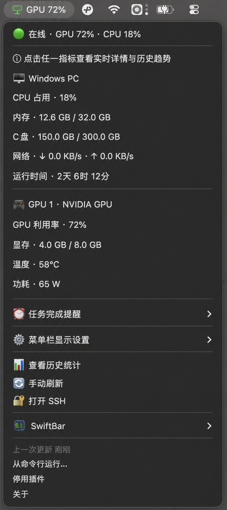
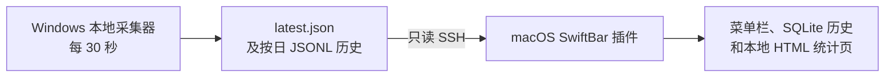

# WinBarMonitor

[](https://github.com/RS-zlk/WinBarMonitor/actions/workflows/ci.yml)

WinBarMonitor 是一个零第三方依赖的 [SwiftBar](https://swiftbar.app/)
插件，用 macOS 菜单栏显示 Windows 电脑的 CPU、内存、C 盘、网络、运行时间、Top
进程以及可选的 NVIDIA GPU 指标。推荐模式下由 Windows 每 30 秒在本机采样，macOS
通过 SSH 仅读取已生成的记录，因此 Mac 关机期间历史不会断档。

[English documentation](README.md)

## 效果图



此截图保留了真实 SwiftBar 菜单布局，但已移除真实主机名、进程名、PID、采样时间、GPU
型号及性能记录；剩余数值均为合成示例，因此可以安全地随开源仓库发布。

## 特性

- 默认使用通用 SSH alias：`windows-monitor`。
- 菜单显示顺序为：远端 hostname → 配置的 alias → `Windows PC`。
- 在线、缓存、离线分别使用绿色、黄色、红色彩色 PNG 图标。
- 本地缓存最近一次成功指标，短暂断网时仍可查看。
- Windows 本地保存最新快照和按 UTC 日期分割的历史文件；Mac 重连后会自动补齐断档。
- 成功数据默认镜像到 Mac 本地 SQLite 30 天，并生成浏览器统计页面。
- 可在菜单中设置 GPU/显存低占用阈值和持续时间；达到条件时发送 macOS 原生通知。
- 机器专属设置保存在 Git 忽略的 `.winbar.env` 中。
- 不需要第三方包，也不需要本项目提供的服务器。
- 支持无 NVIDIA GPU、多 GPU、`N/A` 值和较慢 SSH 链路。

## 推荐架构如何工作



Windows 是数据源：即使 Mac 关机，Windows 仍使用系统内置 API 在本机采样并写入记录。
`windows-files` 模式下 Mac 只读取已完成的文件，不会再触发 Windows 性能查询。按日历史
只保存汇总指标；进程名和 PID 仅存在于会持续覆盖的 `latest.json` 快照中。

## 运行要求

- 安装 Python 3 和 [SwiftBar](https://swiftbar.app/) 的 macOS。
- macOS 自带的 `ssh` 客户端及可连接 Windows 的 SSH alias。
- Windows 10/11、OpenSSH Server，以及 Windows PowerShell 5.1 或更新版本。
- 在 Windows 上有一次管理员权限，用于安装开机启动的本地采集器。
- Windows SSH 账号对记录目录有只读权限。
- 只有需要 GPU 指标时才需要 NVIDIA 驱动和 `nvidia-smi`。

项目没有第三方 Python 依赖，只使用 Python 标准库、POSIX shell、macOS `ssh` 和
Windows 内置组件。

## 快速部署：Windows 持续记录

1. 在 Windows 上克隆或复制本仓库。使用**管理员身份**打开 Windows PowerShell，运行
   下列命令。将 `DESKTOP\monitor` 替换为 Mac SSH 配置中 `User` 对应的 Windows
   账号：

   ```powershell
   .\windows\install-windows-collector.ps1 -ReaderAccount 'DESKTOP\monitor' -IntervalSeconds 30
   ```

   它会将两个可信的本地脚本复制到 `C:\ProgramData\WinBarMonitor`，创建一个开机启动
   的任务，并写入 `latest.json` 与按 UTC 日期分割的 `history` 文件。采集器不主动发起
   网络连接。Windows 任务计划程序的重复触发最短只能设为 1 分钟，因此 30 秒模式使用
   一个常驻但大部分时间休眠的 PowerShell 运行器，而不会每次采样都启动新进程。

2. 在 Mac 安装并运行 SwiftBar，选择插件目录。
3. 创建机器本地配置：

   ```sh
   cp .winbar.env.example .winbar.env
   ```

   编辑 `.winbar.env`，设置 Windows SSH alias，并保留推荐的
   `WINBAR_DATA_SOURCE=windows-files` 配置。该文件已被 Git 忽略。
4. 确认 SSH 无交互连接且可读取记录：

   ```sh
   ssh windows-monitor 'powershell.exe -NoProfile -Command "Get-Content -Raw C:\ProgramData\WinBarMonitor\latest.json"'
   ```

5. 安装插件：

   ```sh
   ./install.sh
   ```

刷新 SwiftBar 即可。生成的插件文件名控制刷新频率，安装程序会把本地配置复制到
SwiftBar，并设置为仅当前用户可读写。每次刷新只读取最新记录，不会触发 Windows
重新采样；Mac 离线重连后会先导入缺失的 Windows 历史，再生成本地报告。

> [!NOTE]
> 采集仅在 Windows 处于唤醒状态时运行。笔记本睡眠时不会记录，也不会为了监控而
> 主动唤醒；唤醒后会自动继续。这能避免空闲时的监控影响电池续航。

## 更新已部署的 Windows 采集器

更新时先拉取新版仓库（或复制其中的 `windows` 文件夹），再在仓库根目录以管理员身份
重复执行原安装命令。它会替换已安装的两个脚本并重启任务，原有 `latest.json` 与
`history` 记录会保留：

```powershell
.\windows\install-windows-collector.ps1 -ReaderAccount 'DESKTOP\monitor' -IntervalSeconds 30
```

Mac 端拉取更新后再次执行 `./install.sh` 即可；本地 `.winbar.env`、SQLite 历史和统计
页面不会被覆盖。

## 兼容：直接 SSH 采集模式

将 `WINBAR_DATA_SOURCE=direct-ssh` 可保留原始模式：每次 SwiftBar 刷新均通过 SSH
执行一次 PowerShell/CIM 查询。它无需安装 Windows 采集器，但 Mac 关机时不会记录。

## Windows OpenSSH 与密钥

在 Windows 安装并启动 OpenSSH Server 可选功能，允许 Windows 防火墙中的 SSH 访问，
并使用权限最小化的专用账号。在 macOS 使用 `ssh-keygen` 创建密钥，将公钥加入
Windows 账号的 authorized keys 文件，然后在 `~/.ssh/config` 添加：

```sshconfig
Host windows-monitor
    HostName windows.example.invalid
    User monitor
    IdentityFile ~/.ssh/id_ed25519
    IdentitiesOnly yes
```

建议通过内网或 VPN 访问、限制防火墙来源，并保持 SSH `BatchMode` 认证。不要将私钥、
密码、token 或真实主机地址提交到仓库。

## 本地配置

`.winbar.env` 使用 shell 风格的 `KEY=VALUE`。真实主机 alias 和机器路径应只放在
这个文件中，不要写入被追踪的源码。安装程序用它确定插件目录和刷新间隔，并把它复制
到已安装的支持模块旁。运行时环境变量的优先级高于配置文件。

所有配置均可选：

| 变量 | 默认值 | 含义 |
| --- | --- | --- |
| `WINBAR_SSH_ALIAS` | `windows-monitor` | SSH config alias |
| `WINBAR_REFRESH_SECONDS` | `30` | 正整数刷新间隔 |
| `WINBAR_SSH_TIMEOUT` | `15` | 正整数采集超时 |
| `WINBAR_DATA_SOURCE` | `direct-ssh` | `windows-files`（推荐）或旧版 `direct-ssh` |
| `WINBAR_REMOTE_DATA_DIR` | `C:\ProgramData\WinBarMonitor` | Windows 端已生成记录所在目录 |
| `WINBAR_WINDOWS_SAMPLE_SECONDS` | `30` | Windows 采样间隔，用于判断重连断档 |
| `WINBAR_CACHE_PATH` | `~/.cache/winbar-monitor/cache.json` | 本地缓存文件 |
| `WINBAR_HISTORY_PATH` | `~/.local/share/winbar-monitor/history.sqlite3` | 本地历史数据库 |
| `WINBAR_REPORT_PATH` | `~/.local/share/winbar-monitor/history.html` | 生成的统计页面 |
| `WINBAR_RETENTION_DAYS` | `30` | 原始采样保留天数 |
| `WINBAR_LOW_USAGE_ALERT_ENABLED` | `false` | 是否启用“任务可能完成”提醒 |
| `WINBAR_LOW_USAGE_GPU_THRESHOLD` | `5` | GPU 利用率低占用阈值（0–100，百分比） |
| `WINBAR_LOW_USAGE_VRAM_THRESHOLD` | `10` | 单块 GPU 显存占用低占用阈值（0–100，百分比） |
| `WINBAR_LOW_USAGE_DURATION_SECONDS` | `300` | 低占用持续时间（秒） |
| `WINBAR_ALERT_STATE_PATH` | `~/.local/share/winbar-monitor/low-usage-alert-state.json` | 提醒状态文件 |
| `SWIFTBAR_PLUGIN_DIR` | SwiftBar 标准插件目录 | 安装位置 |

运行安装或卸载脚本时，可通过 `WINBAR_CONFIG_FILE=/path/to/settings.env` 使用其他
名称的本地配置。数值配置小于 1 时会按 1 处理。

## 历史统计页面

每次 Mac 成功读取都会将数据镜像到 SQLite，并重新生成一个自包含 HTML 页面；若中间
存在断档，会先从 Windows 按日 JSONL 记录中补齐。SwiftBar 菜单只提供“查看历史统计”
入口，汇总和图表均在浏览器中展示。

页面提供最近 2 小时、24 小时、7 天和 30 天的 CPU/GPU 利用率、内存/显存、GPU 温度/功耗
以及网络速率。多 GPU 情况使用最高利用率和温度，并统计显存与功耗合计。采集失败不会
写成错误的零值。页面不加载外部 JavaScript、统计脚本、字体或网络资源。
鼠标悬停在折线节点上时，会显示该节点的本地时间和各条曲线数值。

## 菜单栏显示设置

在 SwiftBar 菜单中打开“⚙️ 菜单栏显示设置”，可用中文选项切换智能概览、GPU/CPU
利用率、显存占用、GPU 温度、GPU 功耗或网络下载速率。设置仅保存在本机；菜单栏中的
彩色显示器图标表示状态，绿色、黄色和红色依次表示在线、使用缓存和离线状态。

## 任务完成提醒

在 SwiftBar 菜单中展开“⏰ 任务完成提醒”。可一键启用 `10% / 10% / 20 分钟`、
`5% / 5% / 10 分钟`等预设；也可选择“输入自定义规则并启用…”，打开**一个**输入框，
一次填写 `GPU 阈值, 显存阈值, 持续分钟`，例如 `5, 5, 10`。选择“关闭提醒”可立即撤销。
这些偏好仅保存在本机的 `settings.json` 中，不会修改项目文件。

当**所有**远端 GPU 的利用率和显存占用均不高于相应阈值，且这个状态连续维持设定时长时，
macOS 会发送一次“任务可能已完成”的原生通知。
GPU 再次高于任一阈值后，提醒会自动重新布防，可用于下一次任务。缓存数据、采集失败、
无 GPU 或 `N/A` 指标不会开始或延长计时，以避免误报。

默认关闭提醒，避免升级后意外打扰。默认阈值为 GPU `5%`、显存 `10%`、持续 `5` 分钟；
可以在菜单中自由修改，也可以用上表的 `WINBAR_LOW_USAGE_*` 环境变量或 `.winbar.env` 预设。
显存可能被机器学习框架缓存，因此若任务结束后显存不会释放，可把显存阈值提高，或先关闭
提醒再重新配置合适的条件。

提醒由 macOS 原生通知发送，因此 Mac 关机时不会弹出通知；Windows 在此期间仍会持续
记录所有样本。云端推送通知不属于本项目的默认部署范围。发生重连断档后，低占用提醒会
重新开始计时，避免把 Mac 未观察到的时间误判为持续低占用。

## 安全与隐私

Mac 通过 SSH 发送编码后的只读 PowerShell 命令，仅读取已生成的记录文件。Windows
采集器不会上传指标、不监听入站连接、也不保存凭据。它以本机 `SYSTEM` 账号运行，
以便在用户未登录时也可采集；仅应从审核过的源码安装。使用 `-ReaderAccount` 只授予
OpenSSH 账号记录目录的读取权限，不要向全部本机用户开放。SSH 密钥、缓存、历史和
报告均由用户控制。最新快照可能包含 hostname 和进程名，历史数据会反映机器使用规律；
请勿把生成文件附加到公开 issue。部署到受管设备前请阅读[安全策略](SECURITY.md)。

## 卸载

在 Mac 使用安装时的同样配置运行：

```sh
./uninstall.sh
```

脚本会移除生成的 SwiftBar 文件及复制的配置，但保留源码目录中的 `.winbar.env`、
缓存、历史和报告。如需删除本地监控数据：

```sh
rm -f "$HOME/.cache/winbar-monitor/cache.json"
rm -f "$HOME/.local/share/winbar-monitor/history.sqlite3" \
      "$HOME/.local/share/winbar-monitor/history.sqlite3-shm" \
      "$HOME/.local/share/winbar-monitor/history.sqlite3-wal" \
      "$HOME/.local/share/winbar-monitor/history.html"
```

在 Windows 以管理员身份运行 PowerShell：

```powershell
.\windows\uninstall-windows-collector.ps1
```

这会移除计划任务并保留记录；只有明确需要永久删除记录目录时才加 `-RemoveData`。

## 故障排查

- 先确认 Windows 的 `C:\ProgramData\WinBarMonitor\latest.json` 已生成，再执行快速
  部署中的读取命令，确认 SSH 账号有读取权限。
- 若菜单和统计页的时间不再推进，请确认 35 秒后时间戳是否变化，并查看本地错误日志：

  ```powershell
  Get-Content -Raw C:\ProgramData\WinBarMonitor\latest.json
  Start-Sleep -Seconds 35
  Get-Item C:\ProgramData\WinBarMonitor\latest.json | Select-Object LastWriteTime
  Get-Content C:\ProgramData\WinBarMonitor\collector-errors.log -Tail 20
  ```

  修复日志中提示的问题后，按照“更新已部署的 Windows 采集器”重新运行安装脚本。常驻的
  30 秒运行器工作时，任务状态显示为 `Running` 属于正常现象。
- 黄色表示采集失败但正在显示本地缓存；红色表示没有可用缓存。
- GPU 字段为 `N/A` 时，在 Windows SSH 会话中检查 `nvidia-smi`。没有 NVIDIA 硬件
  的电脑仍然受支持，只是不显示 GPU 部分；同时可查看 `collector-errors.log`。
- 慢链路可增大 `WINBAR_SSH_TIMEOUT`，并使用 SSH 连接复用。不要把 Windows SSH
  服务暴露到公网。

## 开发与测试

运行标准库测试和 shell 语法检查：

```sh
python3 -m unittest discover -s tests -v
python3 -m py_compile winbar_monitor.py winbar.1m.py
sh -n install.sh uninstall.sh
```

CI 还会解析所有 Windows PowerShell 脚本，并在 Windows GitHub runner 上运行一次本地
采集；不会发起真实 SSH 连接。贡献流程见
[CONTRIBUTING.md](CONTRIBUTING.md)。

仓库中的菜单图为已脱敏、使用合成数值的截图，不是真实主机记录或生成的报告；测试也只
使用合成 fixture，避免暴露机器数据。

## 许可证

MIT，详见 [LICENSE](LICENSE)。
